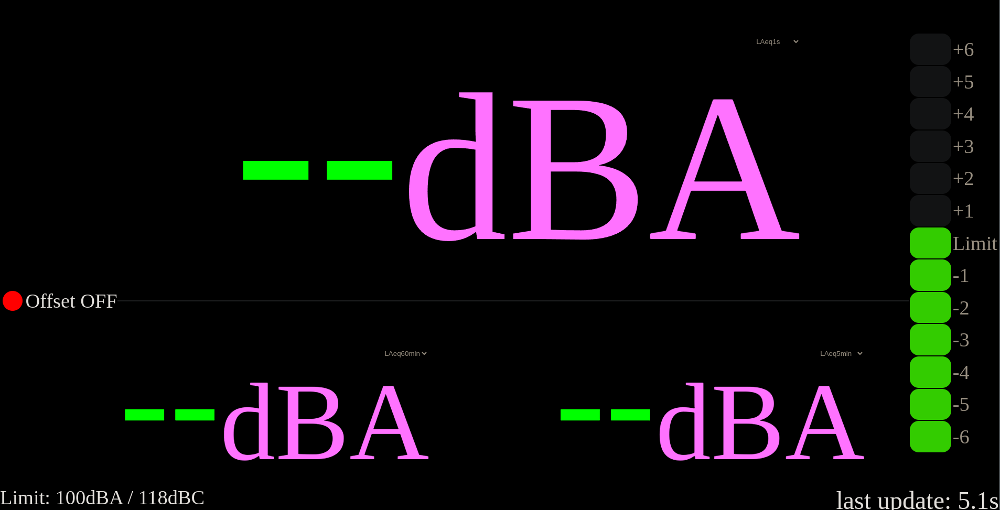
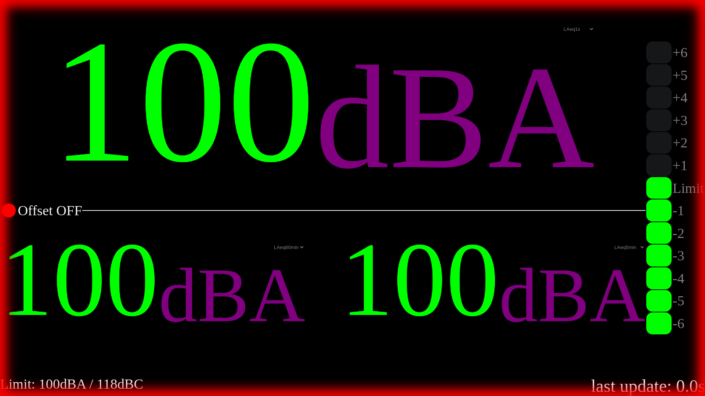

# Alternativ Amix UI for dB meters 

Key futures:
 - doesn't crash when network connection is lost
 - red indicater if connection is lost over 30s
 - time since last update in 100ms steps shown
 - video game damage effect when reaching limit
 - works on **all** screen sizes in landscape
 - looks and feels the same as original interface

## Deploy
Use supplied docker-compose [file](docker-compose.yml).

|works|architecture|
|--|--|
|✅ |amd64|
|✅ |arm64|

# Pictures
## normal

## no connection

# reached limit
